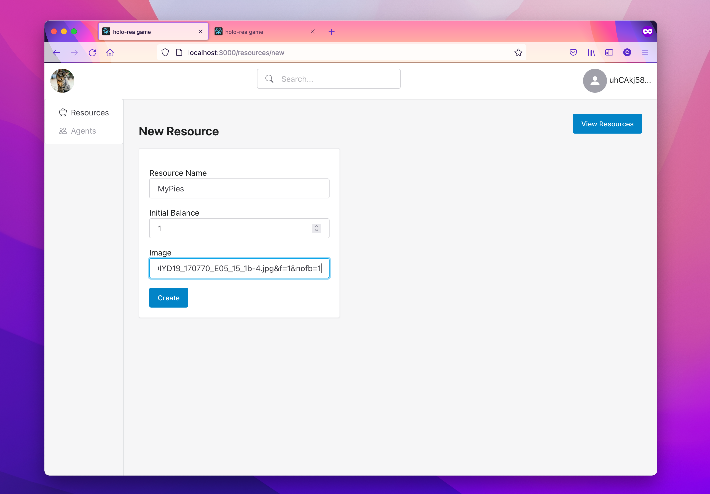
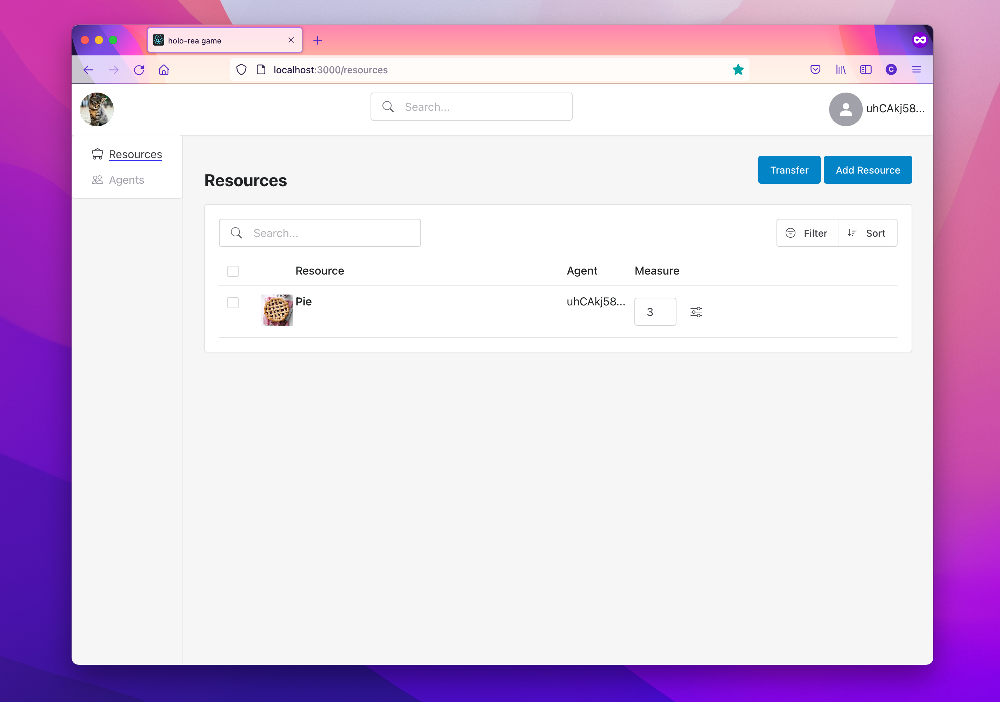
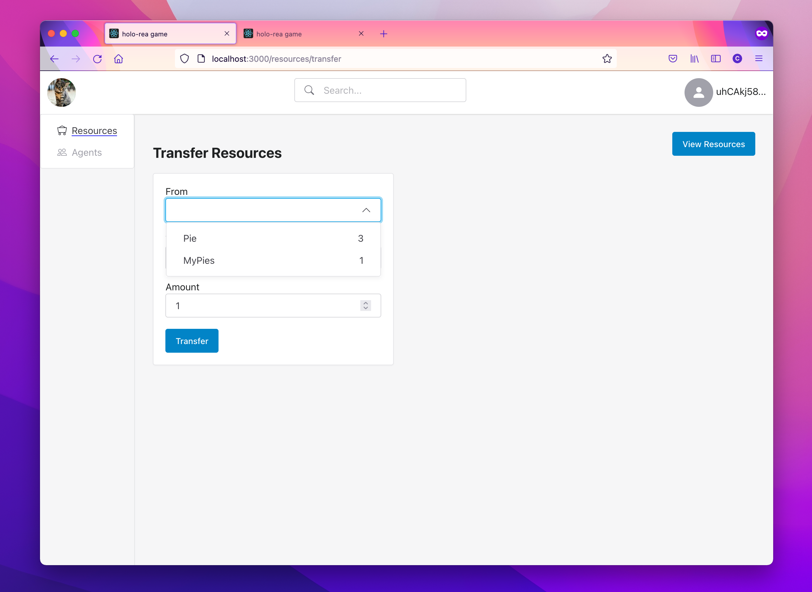

# hREA Network Dashboard

Make sure you're running an hREA `full_suite` happ.

Double check that this value in package.json `scripts -> start` command is right, in terms of the port number for your AppWebsocket on the Holochain runtime:

`REACT_APP_HC_CONN_URL='ws://localhost:17191'`

Run `npm run start`, and open `http://localhost:3000`

